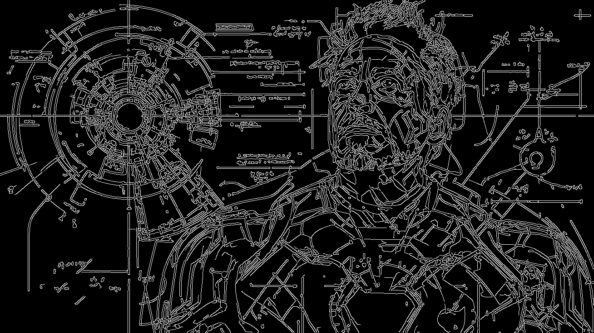

# GPU-Accelerated Canny Edge Detection

A CUDA-based implementation of the Canny edge detection pipeline, demonstrating GPU parallelization for image processing tasks.

## Overview

This project implements the complete Canny edge detection algorithm using CUDA C++, parallelizing each stage of the pipeline for GPU execution. The implementation includes CPU comparison using OpenCV for performance benchmarking.

## Pipeline Stages

### 1. Gaussian Blur
Reduces noise by convolving the image with a Gaussian kernel.
```
for each pixel (x, y):
    weighted_sum = 0
    for each kernel position (i, j):
        weighted_sum += image[x+i][y+j] * gaussian_kernel[i][j]
    blurred[x][y] = weighted_sum
```

### 2. Sobel Gradient Calculation
Computes intensity gradients in x and y directions to detect edges.
```
Gx = convolve(image, sobel_x_kernel)  # horizontal edges
Gy = convolve(image, sobel_y_kernel)  # vertical edges
magnitude = sqrt(Gx² + Gy²)
direction = atan2(Gy, Gx)
```

### 3. Non-Maximum Suppression (NMS)
Thins edges by keeping only local maxima along gradient direction.
```
for each pixel with gradient:
    compare magnitude with neighbors along gradient direction
    if pixel is local maximum:
        keep pixel
    else:
        suppress pixel (set to 0)
```

### 4. Hysteresis Thresholding
Applies double threshold and edge tracking to finalize edges.
```
for each pixel:
    if magnitude > high_threshold:
        strong_edge = True
    else if magnitude > low_threshold:
        weak_edge = True (connect if adjacent to strong edge)
    else:
        not_edge = True
```

## Results

Output files are saved in `kernels/assets/` directory.

### CPU Implementation (OpenCV)


### GPU Implementation (CUDA)


## Performance Benchmarks

```
GPU (CUDA):
  Compilation:  19471.05 ms
  Execution:    2040.62 ms
  Total:        21511.68 ms

CPU (Python + OpenCV):
  Execution:    233.17 ms
```

**Note**: The current GPU implementation includes compilation overhead. The CUDA execution time (2040ms) vs CPU (233ms) shows room for optimization. This is a learning project exploring GPU parallelization techniques.

## Usage

Run the complete pipeline with benchmarking:
```bash
bash run_cuda.sh
```

This will:
1. Compile the CUDA kernels
2. Execute GPU-based edge detection
3. Run CPU implementation for comparison
4. Display performance metrics

## Requirements

- NVIDIA GPU with CUDA support
- CUDA Toolkit
- OpenCV (for CPU comparison)
- Python 3.x

---

*This is a fun experimentation project exploring CUDA programming and GPU acceleration for computer vision tasks.*
