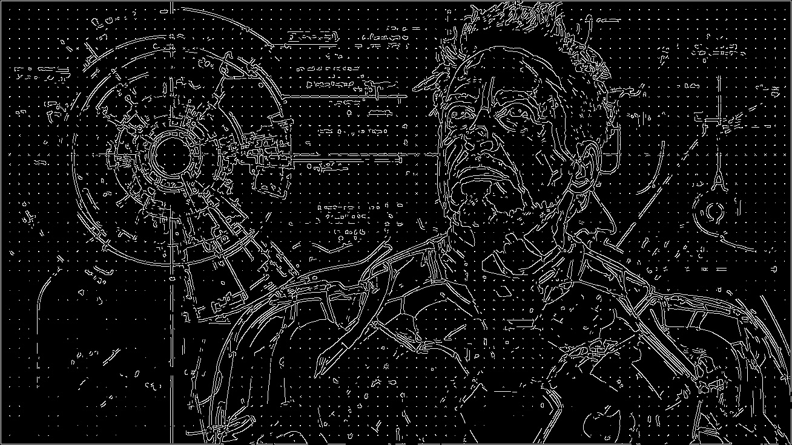

# GPU-Accelerated Canny Edge Detection

A CUDA-based implementation of the Canny edge detection pipeline, demonstrating GPU parallelization for image processing tasks. This project includes two versions: a naive implementation (v1) and an optimized implementation (v2) with advanced GPU optimization techniques.

## Overview

This project implements the complete Canny edge detection algorithm using CUDA C++, parallelizing each stage of the pipeline for GPU execution. The implementation includes CPU comparison using OpenCV for performance benchmarking.

## Implementation Versions

### V1 - Naive CUDA Implementation
Basic GPU parallelization with straightforward kernel implementations.

### V2 - Optimized CUDA Implementation
Advanced GPU optimizations including:

**Gaussian Blur Optimizations:**
- **Shared Memory Tiling**: Reduces global memory accesses by caching tile data in fast shared memory with halo regions for edge handling
- **Constant Memory**: Stores Gaussian kernel coefficients in constant memory for fast broadcast reads
- **Loop Unrolling**: Unrolls convolution loops to reduce instruction overhead and improve ILP
- **Restrict Pointers**: Uses `__restrict__` keyword to enable compiler optimizations by preventing pointer aliasing

**Sobel Gradient Optimizations:**
- **Constant Memory for Sobel Kernels**: Sobel Gx/Gy kernels stored in constant memory instead of registers
- **Shared Memory Tiling**: Tiles with 1-pixel halo regions for efficient 3x3 neighborhood access
- **Loop Unrolling**: Fixed 3x3 kernel application fully unrolled
- **Fast Math**: Uses `__fsqrt_rn()` for faster square root computation in magnitude calculation
- **Restrict Pointers**: Prevents aliasing for better compiler optimization

**Hysteresis Thresholding Optimizations:**
- **Bitwise Operations**: Replaces branching with bitwise operations in thresholding to reduce warp divergence
- **Shared Memory Edge Tracking**: Tiles edges with halo loading for efficient 8-neighbor checking
- **Unrolled Neighbor Checks**: 8-neighbor connectivity check fully unrolled instead of looped
- **Block-Level Atomics**: Uses shared memory reduction to minimize global atomic operations
- **Buffer Swapping**: Efficient iterative edge propagation with pointer swapping instead of copying

## Pipeline Stages

### 1. Gaussian Blur
Reduces noise by convolving the image with a Gaussian kernel.
```
for each pixel (x, y):
    weighted_sum = 0
    for each kernel position (i, j):
        weighted_sum += image[x+i][y+j] * gaussian_kernel[i][j]
    blurred[x][y] = weighted_sum
```

### 2. Sobel Gradient Calculation
Computes intensity gradients in x and y directions to detect edges.
```
Gx = convolve(image, sobel_x_kernel)  # horizontal edges
Gy = convolve(image, sobel_y_kernel)  # vertical edges
magnitude = sqrt(Gx² + Gy²)
direction = atan2(Gy, Gx)
```

### 3. Non-Maximum Suppression (NMS)
Thins edges by keeping only local maxima along gradient direction.
```
for each pixel with gradient:
    compare magnitude with neighbors along gradient direction
    if pixel is local maximum:
        keep pixel
    else:
        suppress pixel (set to 0)
```

### 4. Hysteresis Thresholding
Applies double threshold and edge tracking to finalize edges.
```
for each pixel:
    if magnitude > high_threshold:
        strong_edge = True
    else if magnitude > low_threshold:
        weak_edge = True (connect if adjacent to strong edge)
    else:
        not_edge = True
```

## Results

Output files are saved in `kernels/assets/` directory.

### Input Image:


### CPU Implementation (OpenCV)


### GPU V1 Implementation (Naive CUDA)


### GPU V2 Implementation (Optimized CUDA)


## Performance Benchmarks

### Full Pipeline (Compilation + Execution)
```
Implementation           Compilation       Execution           Total
------------------------------------------------------------
V1 (Naive)           21509.83 ms       2124.94 ms        23634.77 ms
V2 (Optimized)       21664.06 ms       2061.97 ms        23726.03 ms
CPU (Python)         N/A               152.94 ms         152.94 ms
```

### Pure Execution Time (Pre-compiled)
```
Implementation             Execution Time      CUDA Kernels Only
------------------------------------------------------------
V1 (Naive)                 279.06 ms          18.43 ms
V2 (Optimized)             268.83 ms          14.47 ms
CPU (Python)               184.49 ms          N/A
------------------------------------------------------------

Speedup Analysis (Pure Execution):
- V1 vs CPU: 0.66x (CPU faster due to overhead)
- V2 vs CPU: 0.68x (CPU faster due to overhead)
- V2 vs V1: 1.03x (V2 is 3.6% faster than V1)

Speedup Analysis (CUDA Kernels Only):
- V2 vs V1: 1.27x (V2 kernels 27% faster - significant improvement!)
```

**Analysis**:
- **CUDA Kernel Performance**: V2 kernels (14.47ms) are **27% faster** than V1 kernels (18.43ms), demonstrating effective optimization
- **Overall Execution**: CPU appears faster (184ms vs 268-279ms) due to:
  - CUDA initialization overhead (~100ms)
  - Host-device memory transfer overhead
  - CPU using highly optimized OpenCV implementation
- **V2 Optimizations Impact**:
  - Total execution: 3.6% faster (268ms vs 279ms)
  - Kernel-only execution: 27% faster (14.47ms vs 18.43ms)
  - Optimizations show clear benefit in pure compute but overhead masks gains
- **Learning Outcome**: GPU acceleration shines for:
  - Larger images (>4K resolution)
  - Batch processing (multiple images)
  - Scenarios where overhead is amortized
  - This small image (1308×736) shows overhead dominates single-image processing## Usage

Run the complete pipeline with benchmarking:
```bash
bash run_cuda.sh
```

This will:
1. Compile and run V1 (naive) CUDA kernels
2. Compile and run V2 (optimized) CUDA kernels
3. Run CPU implementation for comparison
4. Display compilation + execution metrics
5. Run pre-compiled executables for pure execution timing
6. Display comprehensive performance analysis

## Requirements

- NVIDIA GPU with CUDA support
- CUDA Toolkit
- OpenCV (for CPU comparison)
- Python 3.x

---

*This is a fun experimentation project exploring CUDA programming and GPU acceleration for computer vision tasks. The performance characteristics demonstrate important lessons about GPU overhead, memory transfer costs, and optimization trade-offs.*
